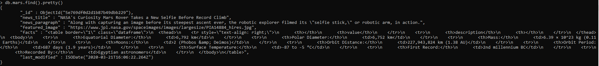
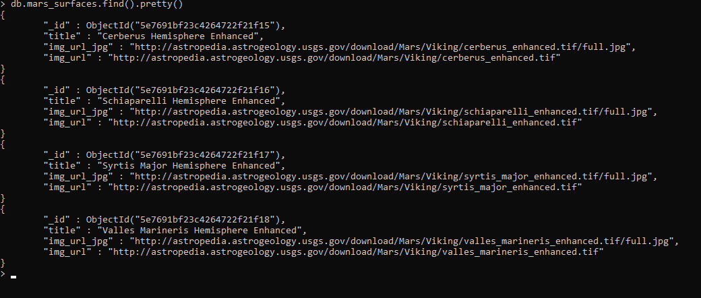
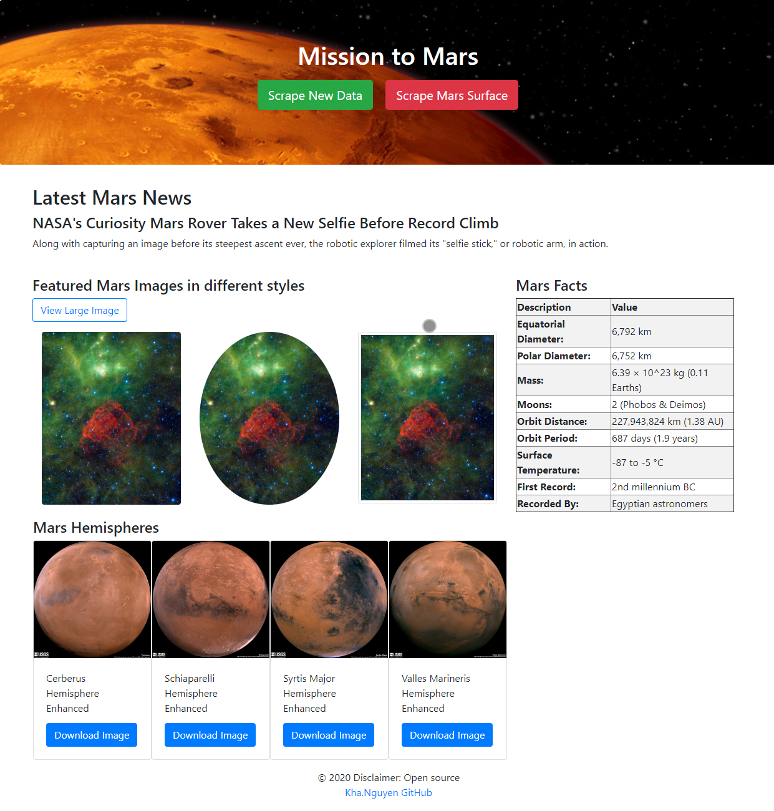
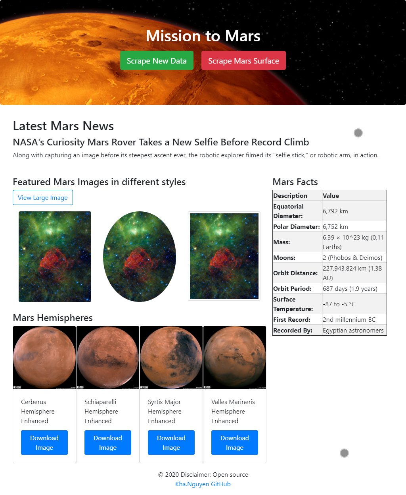
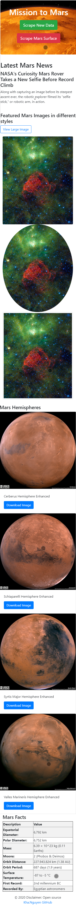

# Mission to Mars
---

**Summary:**
---

Implement scraping program to pull the high-resolution images, updating Mongo to include the new data, and altering the design of web app to accommodate these images. Get the images of Mars’ hemispheres from [https://astrogeology.usgs.gov/search/results?q=hemisphere+enhanced&k1=target&v1=Mars](https://astrogeology.usgs.gov/search/results?q=hemisphere+enhanced&k1=target&v1=Mars) 

**Objectives**
---

1. Use BeautifulSoup and Splinter to automate a web browser and scrape high-resolution images.
2. Use a MongoDB database to store data from the web scrape.
3. Update the web application and Flask to display the data from the web scrape.
4. Use Bootstrap to style the web app.

**Software**

1. Jupyter notebook
2. Visual Studio Code
3. Python 
4. MongoDB

**Dependencies**

1. Splinter
2. BeautifulSoup
3. Pandas
4. Datetime
5. Flask
6. PyMongo

**Sources**

1. [Mission_to_Mars.ipynb](Mission_to_Mars.ipynb)
2. [scraping.py](scraping.py)
3. [app.py](app.py)
4. [/templates/index.html](/templates/index.html)

**Screenshoots**
---

**Scrape website data and Store in Mongo DB**

**Desktop**

**Ipad**

**Iphone**

 
